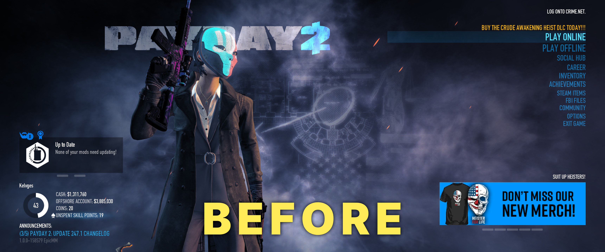
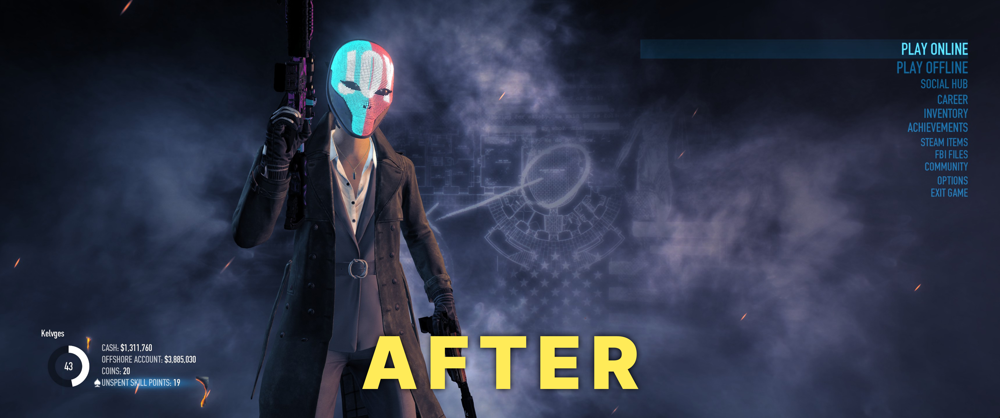

# Clean Main Menu

## Features
The following elements are removed:
- Promotional Banner
- DLC Promo Text
- Menu Option Description
- Main Title Logo
- Announcements Feed
- Mod Manager Widget (You can still access your mods via **Options → BLT / BeardLib Mods**)
- Game Build Version
## Installation
### If you don't have mods installed (Vanilla Game)
1. Download and install [SuperBLT](https://superblt.znix.xyz/) (place `WSOCK21.DLL` into your Payday 2 folder)
2. Launch the game once so SuperBLT can automatically create the `mods` folder, then close the game
3. Download the Clean Main Menu mod (from [ModWorkshop](https://modworkshop.net/mod/58869?tab=downloads) or [GitHub Releases](https://github.com/eidenvelsberg/pd2-clean-main-menu/releases))
4. Extract this mod folder into your `PAYDAY 2/mods/` directory
### If SuperBLT is already installed
1. Download the Clean Main Menu mod (from [ModWorkshop](https://modworkshop.net/mod/58869?tab=downloads) or [GitHub Releases](https://github.com/eidenvelsberg/pd2-clean-main-menu/releases))
2. Extract this mod folder into your `PAYDAY 2/mods/` directory
